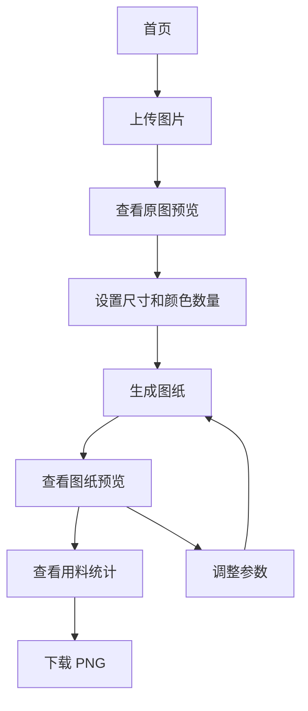

# 拼豆工具网站 V1 产品需求文档

## 1. 文档信息

- 产品名称：拼豆图纸生成器
- 版本：V1
- 文档状态：第一版需求定义
- 核心目标：让用户上传图片后，生成基于 MARD 291 色板的拼豆标准图纸，并下载 PNG 使用。
- 相关数据文件：`mard-291.json`

## 2. 产品背景

拼豆用户在制作图案时，通常需要先把图片转换成有限颜色的像素网格，再根据色号准备豆子并逐格摆放。现有图片编辑工具对新手门槛较高，普通像素化工具又无法保证颜色对应真实拼豆色号。

V1 的产品目标不是做完整社区或专业编辑器，而是先解决最关键的问题：把一张普通图片转换成一张可阅读、可统计、可下载的拼豆图纸。

## 3. 产品定位

这是一个在线拼豆图纸工具站。用户无需注册，打开网页即可上传图片，调整图纸尺寸和颜色数量，预览转换效果，并下载带网格、色号和用料统计的 PNG 图纸。

V1 只支持 MARD 291 色板，不支持多品牌色板切换。

## 4. 目标用户

### 4.1 新手用户

用户特征：
- 不熟悉专业像素软件。
- 不知道如何把图片转换成拼豆可用色号。
- 更关注“能不能照着做”，而不是专业调色能力。

核心需求：
- 操作简单。
- 默认参数可直接生成。
- 图纸清晰，有色号和用料统计。

### 4.2 普通手作爱好者

用户特征：
- 有一定拼豆经验。
- 会关注图纸尺寸、颜色数量、制作难度。
- 可能会反复调整参数直到效果满意。

核心需求：
- 可以控制图纸格数。
- 可以限制颜色数量。
- 能看到每个色号需要多少颗豆子。

### 4.3 分享型用户

用户特征：
- 想把图纸发给朋友、保存到手机或打印。
- 不一定会长期使用账号体系。

核心需求：
- 下载的 PNG 内容完整。
- 图片包含图纸和图例。
- 文件名清晰，方便保存和转发。

## 5. V1 目标

### 5.1 用户目标

用户在 3 分钟内完成以下流程：

1. 上传图片。
2. 设置宽度格数和最大颜色数。
3. 生成拼豆图纸。
4. 查看用料统计。
5. 下载 PNG 图纸。

### 5.2 产品目标

- 验证用户是否愿意使用图片转拼豆图纸工具。
- 验证 MARD 291 色板作为默认色板是否能满足第一批用户。
- 验证 PNG 下载是否足够支持用户的实际制作场景。

### 5.3 成功指标

- 上传成功率大于 90%。
- 上传到生成成功率大于 80%。
- 生成后下载率大于 40%。
- 单次会话中参数调整次数大于 1，说明用户愿意探索效果。

## 6. V1 范围

### 6.1 包含功能

- 图片上传：支持 JPG、PNG、WebP。
- 图片预览：上传后展示原图。
- 图纸尺寸设置：按宽度格数生成，高度按比例自动计算。
- 颜色数量设置：支持限制最大颜色数。
- MARD 291 色板映射：每个格子映射到一个 MARD 色号。
- 图纸预览：显示颜色、网格和色号。
- 透明背景处理：透明区域可保留为非豆子区域。
- 用料统计：显示每个色号颗数、总颜色数、总豆数。
- PNG 下载：下载包含图纸和图例的图片。
- 基础说明：展示色板来源、效果说明和使用建议。

### 6.2 不包含功能

- 登录注册。
- 云端保存历史。
- 用户社区或作品发布。
- PDF 下载。
- 按底板分页打印。
- 手动逐格改色。
- 撤销重做。
- 多品牌色板切换。
- 电商购买清单。
- AI 生图。

## 7. 信息架构

```text
首页
├── 上传入口
├── 产品说明
├── 示例展示
└── 常见问题入口

工具页
├── 图片上传区
├── 参数设置区
├── 原图预览
├── 图纸预览
├── 用料统计
└── 下载操作

说明页
├── MARD 291 色板说明
├── 推荐图片类型
├── 常见问题
└── 版权与免责声明
```

## 8. 核心用户流程



## 9. 页面需求

### 9.1 首页

页面目标：
- 让用户快速理解“这是一个图片转拼豆图纸工具”。
- 引导用户上传图片开始生成。

核心模块：

| 模块 | 需求 |
| --- | --- |
| 首屏标题 | 明确表达“把图片转换成拼豆图纸” |
| 副标题 | 说明支持 MARD 291 色板、自动生成网格和用料表 |
| 上传按钮 | 主按钮文案为“上传图片生成图纸” |
| 示例图 | 展示原图和转换后的拼豆图纸对比 |
| 三步说明 | 上传图片、调整参数、下载图纸 |
| 使用提醒 | 提示色值为参考，实物颜色可能存在偏差 |

建议文案：
- 主标题：把图片转换成拼豆图纸
- 副标题：上传图片，自动生成基于 MARD 291 色板的网格图纸、色号和用料统计。
- 主按钮：上传图片生成图纸

验收标准：
- 用户在首页能明确知道网站用途。
- 用户能从首页直接进入上传流程。

### 9.2 工具页

页面目标：
- 完成上传、设置、生成、预览、统计、下载的完整闭环。

布局建议：
- 桌面端：左侧参数与上传，右侧预览与统计。
- 移动端：按上传、参数、预览、统计、下载的顺序纵向排列。

核心区域：

| 区域 | 内容 |
| --- | --- |
| 上传区 | 拖拽上传、点击上传、格式说明 |
| 参数区 | 宽度格数、最大颜色数、透明背景处理 |
| 原图预览 | 展示上传图片，便于对比 |
| 图纸预览 | 展示转换后的拼豆网格 |
| 统计区 | 总尺寸、总豆数、颜色数量、色号用量 |
| 操作区 | 重新生成、下载 PNG、重置 |

验收标准：
- 用户上传图片后无需离开页面即可完成所有操作。
- 修改参数后可以重新生成图纸。
- 图纸、统计和下载内容保持一致。

### 9.3 说明页

页面目标：
- 解释自动转图的限制。
- 降低用户对色差、版权、实物效果的误解。

内容模块：
- MARD 291 色板说明：说明当前工具使用 MARD 291 色板。
- 图片建议：推荐使用主体清晰、背景简单、颜色块明确的图片。
- 效果说明：照片、渐变、阴影较多的图片可能需要更多颜色才能保持相似度。
- 版权说明：用户应上传自己拥有使用权的图片。
- 色差说明：屏幕显示、色板数据和实物豆子可能存在偏差。

## 10. 功能需求

### 10.1 图片上传

用户故事：
作为用户，我希望上传一张图片，让网站帮我生成拼豆图纸。

需求：
- 支持 JPG、PNG、WebP。
- 仅支持单张图片。
- 文件大小上限为 10MB。
- 上传后展示原图预览。
- 上传后自动进入参数设置和预览区域。
- 图片过大时提示“图片较大，系统会自动压缩后生成预览”。
- 格式错误时提示“请上传 JPG、PNG 或 WebP 图片”。

边界规则：
- 文件大小超过 10MB 时不进入生成流程。
- 文件无法解析时提示重新上传。
- 同一会话再次上传图片时，替换上一张图片和生成结果。

验收标准：
- 用户可以通过点击或拖拽上传图片。
- 上传成功后可以看到原图。
- 不支持的文件类型会被阻止，并展示错误提示。

### 10.2 图纸尺寸设置

用户故事：
作为用户，我希望控制图纸大小，以适配不同尺寸和难度的拼豆作品。

需求：
- 默认宽度为 29 格。
- 提供快捷宽度：14、29、58、87、116。
- 支持自定义宽度，范围 8 到 200。
- 高度按原图比例自动计算。
- 高度计算结果取整数。
- 实时显示最终尺寸，例如 29 x 42。
- 实时显示总豆数。

计算规则：
- 高度 = 四舍五入(原图高度 / 原图宽度 * 宽度格数)。
- 若高度小于 8，提示用户提高宽度或更换图片。
- 若总格数超过 40000，提示图纸较大，生成可能变慢。

验收标准：
- 修改宽度后，高度和总豆数同步更新。
- 超出范围时不可生成。

### 10.3 颜色数量设置

用户故事：
作为用户，我希望控制图纸使用的颜色数量，降低制作难度。

需求：
- 默认最大颜色数为 32 色。
- 可选值：8、16、24、32、48、64、96、无限制。
- 生成后显示实际使用颜色数。
- 当实际颜色数超过 48 时，提示制作难度较高。

产品解释：
- 颜色越少，图纸越简单，但细节损失更明显。
- 颜色越多，图纸更接近原图，但备料和制作更复杂。

验收标准：
- 用户可以切换最大颜色数。
- 降低颜色数量后，图纸使用颜色数不会超过用户设置的上限。

### 10.4 MARD 291 色板映射

用户故事：
作为用户，我希望图纸颜色对应真实拼豆色号，而不是任意屏幕色。

需求：
- 使用 `mard-291.json` 作为 V1 唯一色板。
- 每个非透明格子必须映射到一个 MARD 291 色号。
- 统计区展示每个已使用色号。
- 下载 PNG 中展示图例和色号。

色板字段：
- `code`：MARD 色号，例如 A1。
- `hex`：颜色 HEX，例如 #FFF5CB。
- `r`、`g`、`b`：RGB 数值。

验收标准：
- 图纸中出现的所有色号均存在于 `mard-291.json`。
- 统计区色号与图纸标注一致。

### 10.5 图纸生成

用户故事：
作为用户，我希望获得一张可以照着摆豆的网格图纸。

需求：
- 每个格子代表一颗拼豆。
- 每个格子显示对应颜色。
- 每个格子显示色号或简化编号。
- 显示清晰网格线。
- 深色格子使用浅色文字，浅色格子使用深色文字。
- 透明格子显示为棋盘格或空白，并不计入豆数。

渲染规则：
- 预览图可以根据屏幕大小缩放。
- 下载图应优先保证清晰度。
- 图纸中的文字不能遮挡颜色识别。
- 小格数图纸可以直接显示完整色号。
- 大格数图纸可使用短编号，并在图例中映射到 MARD 色号。

验收标准：
- 用户能看清格子边界。
- 用户能通过图纸和图例知道每个格子应该使用哪种色号。
- 图纸尺寸与参数区一致。

### 10.6 透明背景处理

用户故事：
作为用户，我上传透明图片时，希望透明区域不要被错误统计为豆子。

需求：
- 如果图片包含透明通道，展示透明处理选项。
- 默认选择“保留透明”。
- 选项一：保留透明，透明格不计入豆数。
- 选项二：填充白色背景，透明格按白色或最近 MARD 色号计入豆数。

V1 不做：
- 自定义任意背景色。
- 橡皮擦或手动抠图。

验收标准：
- 透明区域默认不进入用料统计。
- 切换为填充白色后，透明区域进入统计。

### 10.7 预览与对比

用户故事：
作为用户，我希望对比原图和图纸，判断转换效果是否满意。

需求：
- 同页展示原图预览和图纸预览。
- 展示当前参数摘要：尺寸、颜色数、总豆数。
- 参数变化后提示需要重新生成，或自动重新生成。
- 生成失败时保留原图和参数，方便用户调整。

验收标准：
- 用户能看到原图和转换结果。
- 用户能理解当前图纸的制作复杂度。

### 10.8 用料统计

用户故事：
作为用户，我希望知道每个颜色需要多少颗豆子。

需求：
- 显示总尺寸。
- 显示总豆数。
- 显示实际使用颜色数。
- 展示每个色号的用量。
- 每行包含颜色块、MARD 色号、HEX、颗数、建议备料数。
- 默认按颗数从多到少排序。

建议备料规则：
- 建议备料数 = 向上取整(颗数 * 1.05)。
- 页面说明“建议多准备约 5%，避免丢豆或损耗”。

验收标准：
- 各色颗数合计等于非透明格总数。
- 统计区和下载图纸中的图例一致。

### 10.9 PNG 下载

用户故事：
作为用户，我希望下载完整图纸，方便保存、打印或分享。

需求：
- 提供主按钮“下载 PNG”。
- 下载内容包含标题、图纸网格、图例、尺寸、总豆数和色板说明。
- 文件名格式：`mard-pattern-{width}x{height}.png`。
- 下载图的清晰度应高于页面预览。

PNG 内容布局：
- 顶部：图纸名称、尺寸、颜色数量、总豆数。
- 中部：拼豆网格图。
- 底部或右侧：用料图例。
- 页脚：MARD 291 色板参考说明。

验收标准：
- 点击下载后生成 PNG 文件。
- PNG 文件打开后能看到完整图纸和图例。

## 11. 业务规则

### 11.1 默认参数

| 参数 | 默认值 |
| --- | --- |
| 色板 | MARD 291 |
| 图纸宽度 | 29 格 |
| 最大颜色数 | 32 色 |
| 透明处理 | 保留透明 |
| 导出格式 | PNG |
| 用料排序 | 按颗数降序 |

### 11.2 制作难度提示

| 条件 | 提示 |
| --- | --- |
| 总豆数小于 500 | 适合新手 |
| 总豆数 500 到 2500 | 中等难度 |
| 总豆数大于 2500 | 制作时间较长 |
| 使用颜色数大于 48 | 备料复杂度较高 |
| 宽度大于 58 | 建议后续使用分板打印功能 |

### 11.3 图片推荐规则

推荐图片：
- 主体清晰。
- 背景简单。
- 颜色块明确。
- 像素风、图标、卡通图。

不推荐图片：
- 背景复杂的人像照片。
- 大量渐变和阴影。
- 文字很小的图片。
- 细节密集的风景照。

## 12. 状态设计

### 12.1 空状态

文案：
上传一张图片，生成你的第一张拼豆图纸。

展示内容：
- 上传按钮。
- 支持格式说明。
- 示例图入口。

### 12.2 生成中

文案：
正在生成图纸，图片越大可能需要越久。

要求：
- 展示加载状态。
- 禁用重复生成按钮。
- 保留当前参数可见。

### 12.3 上传失败

文案：
上传失败，请检查图片格式或文件大小。

操作：
- 允许重新上传。

### 12.4 参数错误

文案：
宽度格数需在 8 到 200 之间。

操作：
- 禁用生成按钮。
- 高亮错误字段。

### 12.5 效果提醒

文案：
当前图纸颜色较多，制作难度可能偏高。可以降低颜色数量或减少图纸尺寸。

触发条件：
- 实际颜色数大于 48。
- 总豆数大于 2500。

## 13. 非功能需求

### 13.1 性能

- 常规图片生成预览应在 3 秒内完成。
- 大图片应在处理前压缩或缩放。
- 图纸生成过程中页面不应卡死。
- 总格数超过 40000 时应提示风险。

### 13.2 隐私

- V1 优先在浏览器本地处理图片。
- 图片不默认上传服务器。
- 页面需说明“图片仅在当前浏览器中处理，不会主动上传”。

### 13.3 兼容性

- 支持现代桌面浏览器：Chrome、Edge、Safari、Firefox。
- 移动端支持上传、预览和下载。
- 精细查看图纸以桌面端体验优先。

### 13.4 可访问性

- 不只依赖颜色表达信息，必须显示色号或编号。
- 深浅背景上的文字对比度要足够。
- 上传和下载按钮需有明确文本。

## 14. 数据与埋点

V1 可先记录匿名行为，不采集用户图片内容。

建议事件：

| 事件 | 触发时机 | 关键属性 |
| --- | --- | --- |
| image_upload_started | 用户开始选择或拖拽图片 | 来源入口 |
| image_upload_success | 图片解析成功 | 文件类型、文件大小 |
| image_upload_failed | 图片上传失败 | 失败原因 |
| pattern_generate_started | 点击生成 | 宽度、最大颜色数 |
| pattern_generate_success | 生成成功 | 宽高、总豆数、实际颜色数、耗时 |
| pattern_generate_failed | 生成失败 | 失败原因 |
| pattern_download_png | 下载 PNG | 宽高、实际颜色数 |
| params_changed | 修改参数 | 参数名称、修改后值 |

核心漏斗：

```text
访问首页 → 上传图片 → 生成成功 → 下载 PNG
```

## 15. 验收清单

### 15.1 功能验收

- 用户可以上传 JPG、PNG、WebP。
- 上传后能看到原图预览。
- 用户可以选择宽度格数。
- 用户可以选择最大颜色数。
- 用户可以生成 MARD 291 色板图纸。
- 图纸中每个非透明格都有对应色号。
- 页面显示总尺寸、总豆数、使用颜色数。
- 页面显示每个色号的颗数。
- 用户可以下载 PNG。
- 下载 PNG 包含图纸和图例。

### 15.2 边界验收

- 超过 10MB 的图片会提示错误。
- 非图片文件会提示错误。
- 宽度小于 8 或大于 200 时不可生成。
- 透明 PNG 默认保留透明区域。
- 总豆数过大时出现提示。

### 15.3 内容验收

- 页面明确说明使用 MARD 291 色板。
- 页面说明色值为参考，实物可能有偏差。
- 页面提示用户上传有权使用的图片。

## 16. 版本规划

### V1

- 图片上传。
- MARD 291 色板转换。
- 尺寸和颜色数量设置。
- 图纸预览。
- 用料统计。
- PNG 下载。

### V1.1

- PDF 下载。
- 按 29 x 29 底板分页。
- 打印友好的图纸布局。

### V1.2

- 手动改色。
- 撤销重做。
- 自定义背景色。
- 图纸局部放大查看。

### V2

- 多品牌色板。
- 用户保存历史。
- 作品分享。
- 图案库和收藏。

## 17. 第一版推荐取舍

V1 建议坚持以下取舍：

- 只做 MARD 291，不做多品牌。
- 只做 PNG 下载，不做 PDF。
- 不做账号，不保存用户图片。
- 不做手动编辑，先把自动转图闭环打通。
- 默认宽度 29 格，默认颜色数 32 色。
- 用说明文案管理色差、版权和自动转图效果预期。

这些取舍能保证第一版足够小，同时保留真实用户价值：用户可以拿到一张有色号、有网格、有用料统计的拼豆图纸。
