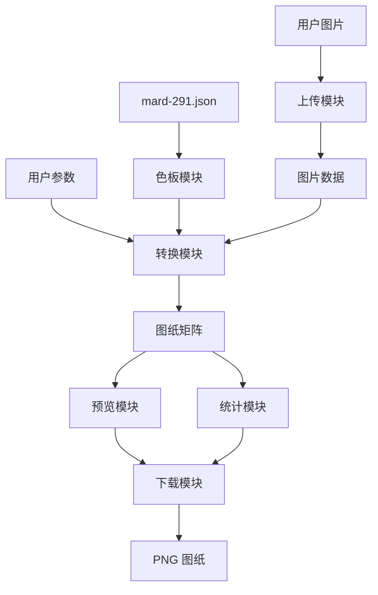

# 拼豆工具网站 V1 执行拆解

## 1. 目的

本文件把 PRD 拆成后续可执行的设计与开发任务，帮助从“产品需求”进入“原型、视觉、开发、测试”的阶段。

## 2. 推荐执行顺序

### 阶段一：原型设计

目标：
- 画出首页、工具页、说明页的低保真原型。
- 确认上传、参数、预览、统计和下载区域的位置。

交付物：
- 首页低保真稿。
- 工具页初始状态、上传成功状态、生成成功状态、错误状态。
- 说明页内容结构。

验收：
- 用户无需阅读说明也能找到上传入口。
- 工具页主流程从上到下或从左到右清晰。

### 阶段二：核心生成能力

目标：
- 读取图片。
- 根据宽度生成目标格数。
- 将颜色映射到 MARD 291 色板。
- 统计每个色号颗数。

核心输入：
- 用户上传图片。
- 宽度格数。
- 最大颜色数。
- 透明背景处理选项。
- `mard-291.json`。

核心输出：
- 图纸格子矩阵。
- 每格对应的 MARD 色号。
- 用料统计。

### 阶段三：图纸预览

目标：
- 将图纸矩阵渲染成可阅读的网格预览。
- 支持原图与图纸对比。
- 展示参数摘要和难度提示。

验收：
- 网格线清晰。
- 色号或编号可读。
- 透明区域与普通颜色区域有明显区分。

### 阶段四：PNG 下载

目标：
- 生成包含图纸和图例的 PNG。
- 下载文件名包含图纸尺寸。

验收：
- 下载图打开后包含标题、尺寸、总豆数、图纸和图例。
- 下载内容与页面预览和统计一致。

### 阶段五：说明与风险提示

目标：
- 补齐色板来源、隐私、版权和自动转图效果说明。
- 降低用户对色差和自动转换效果的误解。

验收：
- 页面明确说明当前只支持 MARD 291。
- 页面明确说明图片在浏览器本地处理。
- 页面明确说明色值和实物可能存在差异。

## 3. 功能模块拆解

| 模块 | 说明 | 依赖 |
| --- | --- | --- |
| 上传模块 | 处理文件选择、拖拽、格式校验、大小校验 | 无 |
| 参数模块 | 管理宽度、颜色数量、透明处理 | 上传模块 |
| 色板模块 | 读取并索引 MARD 291 色板 | `mard-291.json` |
| 转换模块 | 图片缩放、取色、减色、映射色号 | 上传模块、参数模块、色板模块 |
| 预览模块 | 渲染网格、色号、透明格 | 转换模块 |
| 统计模块 | 计算总豆数、颜色数、各色用量 | 转换模块 |
| 下载模块 | 生成包含图纸和图例的 PNG | 预览模块、统计模块 |
| 说明模块 | 展示 FAQ、版权和色差说明 | 无 |

## 4. 数据流

## 5. 测试用例建议

### 5.1 基础图片

用例：
- 上传一张普通 JPG。
- 默认参数生成。
- 下载 PNG。

预期：
- 生成成功。
- 尺寸为 29 x 自动高度。
- 用料统计合计等于总豆数。

### 5.2 透明 PNG

用例：
- 上传一张带透明背景的 PNG。
- 使用默认“保留透明”。

预期：
- 透明区域不计入豆数。
- 图纸中透明区域有明确视觉区分。

### 5.3 大尺寸图片

用例：
- 上传接近 10MB 的图片。
- 选择 116 格宽。

预期：
- 出现性能或难度提示。
- 页面不应卡死。

### 5.4 参数边界

用例：
- 宽度输入 7。
- 宽度输入 201。
- 宽度输入非数字。

预期：
- 不允许生成。
- 展示明确错误提示。

### 5.5 颜色数量

用例：
- 同一张图片分别选择 8 色、32 色、无限制。

预期：
- 实际使用颜色数不超过用户设置。
- 预览效果随颜色数量变化。

## 6. 后续决策点

V1 开始实现前建议确认：
- 是否坚持图片仅在浏览器本地处理。
- PNG 下载是否必须包含完整用料表。
- 大尺寸图纸是否在 V1 限制最大总格数。
- 页面视觉风格是偏“工具效率”还是偏“手作可爱”。

如果不额外确认，建议采用 PRD 中的默认方案：
- 本地处理。
- PNG 包含完整图纸和图例。
- 宽度限制 8 到 200。
- 默认 29 格、32 色。
